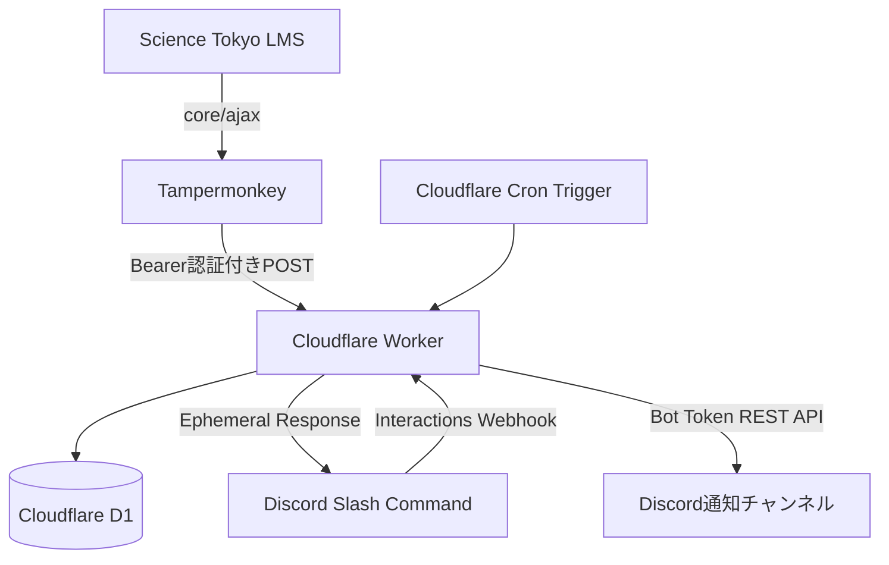

# Codex 実装指示書：Science Tokyo LMS 課題通知BotのCloudflare移行

このファイルは、リポジトリ直下の `AGENTS.md` として配置し、Codexが最初に読む実装指示書として使用する。

Codexは、作業開始前にこの文書を最後まで読み、現在のワーキングツリーを確認してから実装すること。

---

## 0. Codexへの最重要指示

### 0.1 実装目的

現在ローカルPCで稼働している次の構成を、Cloudflare上で常時稼働する構成へ移行する。

```text
現在
Science Tokyo LMS
  ↓ Tampermonkey
ローカルPC上のExpress API
  ↓
ローカルSQLite
  ↓
discord.js Gateway Bot + setInterval
```

```text
移行後
Science Tokyo LMS
  ↓ Tampermonkey（ログイン済みブラウザ）
Cloudflare Workerの同期API
  ↓
Cloudflare D1
  ├─ 課題一覧
  ├─ 同期履歴
  └─ 通知履歴
  ↓
Cloudflare Cron Trigger
  ↓
Discord REST APIによる期限通知

Discordスラッシュコマンド
  ↓ HTTPS Interactions Endpoint
Cloudflare Worker
  ↓
Cloudflare D1
```

### 0.2 作業方針

- 現在のリポジトリを**同一リポジトリ内でCloudflare Workers向けに移行**する。
- Git履歴がある場合、旧Node.js実装を `legacy/` へ複製する必要はない。履歴で参照できるため、不要な重複コードは残さない。
- ただし、ユーザーがローカルで既に変更したコードを勝手に破棄しないこと。
- 特に `src/reminders.ts`、`src/types.ts`、`src/format.ts` は、24時間以内の1時間ごと通知へ変更済みである可能性がある。最初に `git status` と実ファイルを確認すること。
- ユーザーの `.env`、`.dev.vars`、Botトークン、同期トークンを表示・ログ出力・コミットしないこと。
- 実装完了時に、型検査・テスト・ローカル動作確認を行うこと。
- CloudflareやDiscordへのログイン、Secret登録、Developer Portalの設定など、ユーザー操作が必要な部分はREADMEに明記する。値を推測して埋めないこと。
- Windowsの**コマンドプロンプト**で実行できるコマンドをREADMEの主手順にすること。PowerShell専用コマンドを主手順にしない。

### 0.3 完了時に必ず行うこと

1. `npm install`
2. `npm run typecheck`
3. `npm test`
4. 必要に応じて `npm run dev`
5. 変更内容と、ユーザーが次に実行するコマンドをREADMEへ反映
6. `git status` を確認し、秘密ファイルや生成物が追跡対象になっていないことを確認

---

## 1. 背景と確認済み事項

### 1.1 LMS

対象LMSはScience Tokyo LMSであり、Moodleを母体としている。

現在のURL例：

```text
https://lms.s.isct.ac.jp/2025/
```

外部REST APIのエンドポイント自体は存在するが、学生ユーザーが利用できるWeb Serviceトークンを自己発行できない可能性が高い。

そのため、MoodleへBotが直接ログインする方式は採用しない。

### 1.2 課題取得方式

ログイン済みブラウザ上のTampermonkeyから、MoodleのAMDモジュール `core/ajax` を利用し、次の関数を呼び出す。

```text
core_calendar_get_action_events_by_timesort
```

取得済みの実データ例：

```json
{
  "id": 35798,
  "course": "応用電子回路 / Advanced Electronic Circuits",
  "title": "第9回課題(〆切7/16, 17:00)",
  "deadline": "2026/7/16 17:00:00",
  "module": "assign",
  "url": "https://lms.s.isct.ac.jp/2025/mod/assign/view.php?id=124762",
  "overdue": false
}
```

この方式では、次の認証情報をCloudflareへ送らない。

- LMSのCookie
- `sesskey`
- 大学アカウントのパスワード
- SSO認証情報
- MoodleのページHTML全体

送る情報は、課題名・科目名・期限・リンク・イベントID等に限定する。

### 1.3 方法Bの制約

Cloudflare側はLMSへ自動アクセスしない。

したがって、次の情報は、ユーザーがブラウザでLMSを開きTampermonkeyが同期した時点で更新される。

- 新しく追加された課題
- 変更された期限
- 削除・非表示になった課題

一度Cloudflareへ同期された課題の期限通知は、ユーザーのPCを閉じてもCloudflare上で継続する。

---

## 2. 現在のリポジトリ構成

元実装は概ね次の構成である。

```text
src/
  api.ts
  commands.ts
  config.ts
  db.ts
  discord.ts
  format.ts
  index.ts
  register-commands.ts
  reminders.ts
  repository.ts
  types.ts
userscript/
  science-tokyo-lms-sync.user.js
.env.example
package.json
tsconfig.json
README.md
```

現在の技術要素：

- Node.js
- Express
- `node:sqlite`
- `discord.js`
- Gateway接続
- `setInterval()` による期限確認
- ローカル `.env`

移行後はこれらをCloudflare Workers向けに置き換える。

---

## 3. 移行後の確定アーキテクチャ

### 3.1 使用技術

- Cloudflare Workers
- Cloudflare D1
- Cloudflare Cron Triggers
- Discord HTTP Interactions
- Discord REST API
- TypeScript
- Wrangler
- Zodまたは同等の入力検証
- Tampermonkey

### 3.2 使用しないもの

移行後の本番実装では、次を使用しない。

- 常駐Node.jsサーバー
- Express
- `node:sqlite`
- `discord.js` Gatewayクライアント
- `setInterval()`
- ローカルファイルDB
- Railway固有設定
- VPS固有設定

Botユーザー自体は、期限通知をチャンネルへ投稿するため引き続きDiscordサーバーへ参加させる。

### 3.3 リクエスト経路



---

## 4. 機能要件

## 4.1 LMS課題同期

### エンドポイント

```text
POST /api/v1/assignments/sync
```

### 認証

```http
Authorization: Bearer <SYNC_TOKEN>
```

- `SYNC_TOKEN` はCloudflare Secretとして保持する。
- 未指定、不正形式、不一致の場合は `401`。
- 認証失敗時に期待値や受信値をログへ出さない。

### Content-Type

```text
application/json
```

### 最大サイズ

- リクエスト本文は256 KiB以下とする。
- 課題件数は最大500件まで検証上許可する。
- 現在のユーザースクリプトはMoodle APIの都合上、通常最大50件である。

### 成功応答

```json
{
  "ok": true,
  "received": 8,
  "active": 8
}
```

### 入力不正

```json
{
  "error": "invalid_payload",
  "details": []
}
```

HTTPステータスは `400`。

---

## 4.2 同期ペイロード仕様

次の既存形式との互換性を維持する。

```ts
interface SyncPayload {
  source: string;
  complete: boolean;
  assignments: AssignmentInput[];
}

interface AssignmentInput {
  source: string;
  eventId: number;
  courseModuleId: number | null;
  course: string;
  courseJa: string;
  title: string;
  deadlineUnix: number;
  deadlineIso: string;
  deadlineJst: string | null;
  module: string;
  url: string;
  overdue: boolean;
  syncedAt: string;
}
```

例：

```json
{
  "source": "science-tokyo-lms-2025",
  "complete": true,
  "assignments": [
    {
      "source": "science-tokyo-lms-2025",
      "eventId": 35798,
      "courseModuleId": 124762,
      "course": "応用電子回路 / Advanced Electronic Circuits",
      "courseJa": "応用電子回路",
      "title": "第9回課題(〆切7/16, 17:00)",
      "deadlineUnix": 1784188800,
      "deadlineIso": "2026-07-16T08:00:00.000Z",
      "deadlineJst": "2026/7/16 17:00:00",
      "module": "assign",
      "url": "https://lms.s.isct.ac.jp/2025/mod/assign/view.php?id=124762",
      "overdue": false,
      "syncedAt": "2026-07-14T02:00:00.000Z"
    }
  ]
}
```

### 検証規則

最低限、次を検証する。

- `source` は1〜100文字。
- `source` は原則として `science-tokyo-lms-YYYY` 形式。
- 各課題の `source` はトップレベルの `source` と一致する。
- `eventId` は0以上の整数。
- `courseModuleId` は0以上の整数または `null`。
- `course`、`courseJa`、`title` は空文字不可。
- `deadlineUnix` は正の整数。
- `deadlineIso` はISO 8601日時。
- `deadlineUnix` と `deadlineIso` が大きく矛盾する場合は拒否する。
- `url` はHTTPS URL。
- `url` のホストは原則として `lms.s.isct.ac.jp`。
- `assignments` は最大500件。
- `deadlineJst` と `syncedAt` は互換性のため受理するが、サーバー時刻の根拠として信用しない。

期限計算の唯一の基準は `deadlineUnix` とする。

---

## 4.3 完全同期と不完全同期

`complete` の意味は重要であり、必ず維持する。

### `complete: true`

今回の同期結果が、その `source` の有効な課題一覧全体であることを意味する。

処理：

1. 該当 `source` の全課題を一旦 `is_active = 0` にする。
2. 受信した課題をUPSERTし、`is_active = 1` に戻す。
3. 同期履歴を記録する。

### `complete: false`

Moodle APIの50件上限等により、一覧が完全でない可能性がある。

処理：

1. 既存課題を一括無効化しない。
2. 受信した課題だけUPSERTする。
3. 同期履歴へ不完全同期として記録する。

50件ちょうど取得した場合、ユーザースクリプトは原則として `complete: false` を送る。

---

## 4.4 課題一覧コマンド

### コマンド

```text
/assignments
```

日本語ローカライズ：

```text
/課題
```

### オプション

```text
days: integer
```

日本語ローカライズ：

```text
日数
```

- 最小値：1
- 最大値：365
- 既定値：30

### 動作

- 現在時刻以降、指定日数以内の `is_active = 1` の課題を期限順に取得する。
- 最大50件。
- DiscordのEphemeral応答とする。
- 各項目に次を表示する。
  - 日本語科目名
  - 課題名
  - 絶対期限
  - 相対期限
  - 課題ページリンク
- Discordの文字数制限を超えないよう約3800文字で省略する。

表示例：

```text
応用電子回路 — 第9回課題
2026年7月16日 17:00（2日後） · 課題を開く
```

Discordのタイムスタンプ記法を使用する。

```text
<t:UNIX:F>
<t:UNIX:R>
```

---

## 4.5 同期状態コマンド

### コマンド

```text
/sync-status
```

日本語ローカライズ：

```text
/同期状態
```

### 動作

最新の同期履歴をEphemeral応答で表示する。

表示項目：

- 最終同期日時
- 受信件数
- 完全同期かどうか
- `source`

同期履歴がない場合：

```text
まだLMSから同期されていません。
```

---

## 4.6 期限通知仕様

### 必須通知

締切まで24時間を**切った後**、1時間区分ごとにメンション付き通知を1回送る。

通知種別：

```text
hourly-24
hourly-23
hourly-22
...
hourly-2
hourly-1
```

### 7日前通知

既存仕様として、締切7日以内に入った時点の1回通知 `7d` も維持する。

ただし、24時間未満では時間通知を優先し、同一Cron実行内で1課題に複数通知を送らない。

### 時間区分の計算

```ts
remainingSeconds = deadlineUnix - nowUnix
```

- `remainingSeconds <= 0`：通知しない。
- `0 < remainingSeconds < 24 * 3600`：

```ts
remainingHours = Math.ceil(remainingSeconds / 3600)
reminderType = `hourly-${remainingHours}`
```

`remainingHours` は1〜24へクランプする。

例：

| 残り時間 | 通知種別 | 表示 |
|---|---:|---|
| 23時間50分 | `hourly-24` | 締切まで24時間を切りました |
| 22時間59分 | `hourly-23` | 締切まで23時間を切りました |
| 30分 | `hourly-1` | 締切まで1時間を切りました |

### Cron頻度

```text
*/5 * * * *
```

5分ごとに実行する。

したがって通知には最大約5分の遅れがあり得る。これは許容する。

### 停止中の通知を一括送信しない

Cloudflare側の障害等で数時間Cronが実行されなかった場合、復旧時には**現在の時間区分だけ**を送る。

例：

- `hourly-20` から `hourly-5` まで停止していた。
- 復旧時点が残り4時間40分。
- `hourly-5` だけ送る。
- 失われた15件を連続送信しない。

### 期限変更

通知履歴の主キーに `deadline_unix` を含める。

同じ課題イベントでも教員が期限を変更した場合、新しい期限について通知スケジュールをやり直す。

### 通知本文

- `DISCORD_MENTION` が設定されていれば本文先頭でメンションする。
- Embedには科目名、課題名、期限、相対期限、リンクを表示する。
- `allowed_mentions` で、設定されたユーザーまたはロールだけを明示的に許可する。
- `@everyone` や意図しないメンションを解析しない。

---

## 5. D1データベース仕様

## 5.1 初期マイグレーション

`migrations/0001_initial.sql` を作成する。

推奨スキーマ：

```sql
CREATE TABLE IF NOT EXISTS assignments (
  source            TEXT NOT NULL,
  event_id          INTEGER NOT NULL,
  course_module_id  INTEGER,
  course_name       TEXT NOT NULL,
  course_name_ja    TEXT NOT NULL,
  title             TEXT NOT NULL,
  deadline_unix     INTEGER NOT NULL,
  deadline_iso      TEXT NOT NULL,
  module            TEXT NOT NULL,
  url               TEXT NOT NULL,
  overdue           INTEGER NOT NULL DEFAULT 0 CHECK (overdue IN (0, 1)),
  first_seen_at     TEXT NOT NULL,
  last_seen_at      TEXT NOT NULL,
  is_active         INTEGER NOT NULL DEFAULT 1 CHECK (is_active IN (0, 1)),
  PRIMARY KEY (source, event_id)
);

CREATE INDEX IF NOT EXISTS idx_assignments_upcoming
  ON assignments (is_active, deadline_unix);

CREATE TABLE IF NOT EXISTS reminder_logs (
  source          TEXT NOT NULL,
  event_id        INTEGER NOT NULL,
  deadline_unix   INTEGER NOT NULL,
  reminder_type   TEXT NOT NULL,
  status          TEXT NOT NULL CHECK (status IN ('pending', 'sent')),
  claimed_at      TEXT NOT NULL,
  sent_at         TEXT,
  last_error      TEXT,
  PRIMARY KEY (source, event_id, deadline_unix, reminder_type)
);

CREATE INDEX IF NOT EXISTS idx_reminder_pending
  ON reminder_logs (status, claimed_at);

CREATE TABLE IF NOT EXISTS sync_runs (
  id              INTEGER PRIMARY KEY AUTOINCREMENT,
  source          TEXT NOT NULL,
  synced_at       TEXT NOT NULL,
  received_count  INTEGER NOT NULL,
  complete        INTEGER NOT NULL CHECK (complete IN (0, 1))
);
```

### D1利用上の注意

- Node.jsの `BEGIN IMMEDIATE` / `COMMIT` をそのまま移植しない。
- 同期処理は `env.DB.batch([...])` を用いて、無効化・UPSERT・同期履歴挿入を一つのバッチにまとめる。
- 現在の最大受信件数は50件程度なので、1バッチで問題ない。
- 全SQLはバインド変数を使い、文字列連結で値を埋め込まない。

---

## 5.2 通知の重複防止と送信失敗対策

単純な「Discord送信後に履歴をINSERT」だけでは、履歴保存失敗時に重複する。

単純な「履歴INSERT後にDiscord送信」だけでは、送信失敗時に通知を失う。

次のクレーム方式を実装する。

### 送信手順

1. 15分以上前の `pending` レコードを削除または再取得可能にする。
2. 対象通知について `INSERT OR IGNORE` で `pending` レコードを作る。
3. `changes === 0` なら他の実行が取得済みまたは送信済みなのでスキップする。
4. Discord REST APIへ送信する。
5. 成功時は `status = 'sent'`、`sent_at = now` に更新する。
6. 失敗時はクレーム行を削除し、次回Cronで再試行できるようにする。
7. 1件の送信失敗で他課題の通知処理を中断しない。

Workerがクレーム直後に異常終了した場合でも、15分後に再試行可能であること。

---

## 6. Cloudflare Worker HTTP仕様

WorkerのエントリポイントはES Modules形式とする。

```ts
export default {
  async fetch(request: Request, env: Env, ctx: ExecutionContext) {
    // HTTP routing
  },

  async scheduled(
    controller: ScheduledController,
    env: Env,
    ctx: ExecutionContext,
  ) {
    // Reminder check
  },
};
```

### ルート一覧

| Method | Path | 用途 |
|---|---|---|
| GET | `/health` | 稼働確認 |
| POST | `/api/v1/assignments/sync` | Tampermonkey同期 |
| POST | `/discord/interactions` | Discordスラッシュコマンド |

存在しないルートはJSONまたはプレーンテキストで `404`。

### `/health`

例：

```json
{
  "ok": true,
  "now": "2026-07-14T02:00:00.000Z",
  "lastSync": {
    "source": "science-tokyo-lms-2025",
    "syncedAt": "2026-07-14T01:50:00.000Z",
    "receivedCount": 8,
    "complete": true
  }
}
```

課題名、Discordトークン、同期トークン等を返さない。

---

## 7. Discord Interactions実装

## 7.1 GatewayからHTTP Interactionsへの移行

現在の `discord.js` Client、Gateway接続、`InteractionCreate`イベントは削除する。

スラッシュコマンドは次へ移行する。

```text
Discord
  ↓ POST
/discord/interactions
```

Discord Developer Portalの `Interactions Endpoint URL` には、デプロイ後に次を指定する。

```text
https://<worker-domain>/discord/interactions
```

Gateway方式とInteractions Endpoint方式を同時に使わない。

## 7.2 署名検証

Discordから来るすべてのInteractionsリクエストについて、JSONパース前の生本文を使って署名検証する。

ヘッダー：

```text
x-signature-ed25519
x-signature-timestamp
```

Secretではなく、Discord Developer PortalのPublic Keyを使用する。

推奨：

```text
discord-interactions
```

ライブラリの `verifyKey` をCloudflare Workers上で利用する。

署名不正・必須ヘッダー欠落は `401`。

## 7.3 PING

DiscordがEndpoint URLを検証するため、Interaction Type `1` に対して次を返す。

```json
{
  "type": 1
}
```

## 7.4 APPLICATION_COMMAND

Interaction Type `2` を処理する。

基本コマンド名はローカライズ名ではなく次を使う。

```text
assignments
sync-status
```

応答は3秒以内に返す。

D1の小規模SELECTだけで完了するため、原則として即時応答 `type: 4` を使う。

Ephemeral応答には次を使う。

```json
{
  "type": 4,
  "data": {
    "flags": 64,
    "content": "..."
  }
}
```

---

## 8. Discordへの能動的通知

期限通知はDiscord REST APIへ直接送る。

```text
POST https://discord.com/api/v10/channels/{DISCORD_CHANNEL_ID}/messages
```

ヘッダー：

```http
Authorization: Bot <DISCORD_BOT_TOKEN>
Content-Type: application/json
```

成功は2xxとして扱う。

失敗時はレスポンスステータスと、安全な範囲のレスポンス本文をログへ残す。ただしBotトークンを出力しない。

### allowed_mentions

`DISCORD_MENTION` の形式：

```text
<@USER_ID>
```

または：

```text
<@&ROLE_ID>
```

ユーザーメンションの場合：

```json
{
  "parse": [],
  "users": ["USER_ID"]
}
```

ロールメンションの場合：

```json
{
  "parse": [],
  "roles": ["ROLE_ID"]
}
```

未設定または不正形式なら：

```json
{
  "parse": []
}
```

---

## 9. Discordコマンド登録

Guildコマンドとして登録する。

登録先：

```text
PUT /api/v10/applications/{APPLICATION_ID}/guilds/{GUILD_ID}/commands
```

専用スクリプトを用意する。

推奨ファイル：

```text
scripts/register-commands.ts
```

コマンド定義：

```json
[
  {
    "name": "assignments",
    "name_localizations": { "ja": "課題" },
    "description": "Show upcoming LMS assignments",
    "description_localizations": { "ja": "LMSの未期限課題を表示します" },
    "type": 1,
    "options": [
      {
        "type": 4,
        "name": "days",
        "name_localizations": { "ja": "日数" },
        "description": "Number of days to show",
        "description_localizations": { "ja": "何日先まで表示するか" },
        "min_value": 1,
        "max_value": 365,
        "required": false
      }
    ]
  },
  {
    "name": "sync-status",
    "name_localizations": { "ja": "同期状態" },
    "description": "Show the latest LMS sync status",
    "description_localizations": { "ja": "LMSとの最終同期状態を表示します" },
    "type": 1
  }
]
```

登録スクリプトはローカルの `.dev.vars` を読み込んでよいが、Worker本体は `dotenv` に依存しないこと。

---

## 10. Cloudflare設定

## 10.1 `wrangler.jsonc`

次の構造を基準とする。

```jsonc
{
  "$schema": "node_modules/wrangler/config-schema.json",
  "name": "science-tokyo-lms-discord-bot",
  "main": "src/index.ts",
  "compatibility_date": "2026-07-14",

  "d1_databases": [
    {
      "binding": "DB",
      "database_name": "science-tokyo-lms-discord-bot",
      "database_id": "REPLACE_WITH_D1_DATABASE_ID",
      "migrations_dir": "migrations"
    }
  ],

  "triggers": {
    "crons": ["*/5 * * * *"]
  },

  "vars": {
    "DISCORD_APPLICATION_ID": "REPLACE_ME",
    "DISCORD_GUILD_ID": "REPLACE_ME",
    "DISCORD_CHANNEL_ID": "REPLACE_ME",
    "DISCORD_MENTION": ""
  },

  "observability": {
    "enabled": true
  }
}
```

実装時点でCloudflare CLIが推奨する設定形式に合わせて調整してよい。

`database_id` やDiscord IDをCodexが推測しないこと。

## 10.2 Secrets

Cloudflare Secretとして登録する値：

```text
SYNC_TOKEN
DISCORD_BOT_TOKEN
DISCORD_PUBLIC_KEY
```

本番登録コマンド：

```cmd
npx wrangler secret put SYNC_TOKEN
npx wrangler secret put DISCORD_BOT_TOKEN
npx wrangler secret put DISCORD_PUBLIC_KEY
```

### ローカル開発

`.dev.vars.example` をコミットする。

```dotenv
SYNC_TOKEN=replace-with-a-long-random-string
DISCORD_BOT_TOKEN=replace-with-discord-bot-token
DISCORD_PUBLIC_KEY=replace-with-discord-public-key
DISCORD_APPLICATION_ID=replace-with-application-id
DISCORD_GUILD_ID=replace-with-guild-id
DISCORD_CHANNEL_ID=replace-with-channel-id
DISCORD_MENTION=<@replace-with-user-id>
```

実値は `.dev.vars` に書き、Gitへコミットしない。

`.env` と `.dev.vars` の両方をWorkerローカル実行に混在させない。

---

## 11. 推奨ファイル構成

実装後の目標：

```text
.
├─ AGENTS.md
├─ README.md
├─ package.json
├─ package-lock.json
├─ tsconfig.json
├─ wrangler.jsonc
├─ .gitignore
├─ .dev.vars.example
├─ migrations/
│  └─ 0001_initial.sql
├─ scripts/
│  └─ register-commands.ts
├─ src/
│  ├─ index.ts
│  ├─ env.ts
│  ├─ router.ts
│  ├─ schemas.ts
│  ├─ repository.ts
│  ├─ sync.ts
│  ├─ reminders.ts
│  ├─ discord-api.ts
│  ├─ discord-interactions.ts
│  ├─ format.ts
│  └─ types.ts
├─ test/
│  ├─ reminder-policy.test.ts
│  ├─ sync.test.ts
│  └─ interactions.test.ts
└─ userscript/
   └─ science-tokyo-lms-sync.user.js
```

厳密に同じ分割でなくてもよいが、次を分離すること。

- HTTPルーティング
- 入力検証
- D1アクセス
- リマインダー判定
- Discord REST送信
- Discord Interactions処理
- 表示整形

---

## 12. package.json要件

### Runtime dependency候補

- `zod`
- `discord-interactions`

### Dev dependency候補

- `typescript`
- `wrangler`
- `tsx`
- `vitest`
- `@cloudflare/vitest-pool-workers`
- `dotenv`（コマンド登録スクリプトのみで必要なら使用）

### 削除対象

- `express`
- `discord.js`
- `@types/express`
- 本番Workerからの `dotenv`
- `node:sqlite` 前提のコード

### 推奨scripts

```json
{
  "scripts": {
    "dev": "wrangler dev --test-scheduled",
    "deploy": "wrangler deploy",
    "typecheck": "tsc --noEmit",
    "test": "vitest run",
    "test:watch": "vitest",
    "register-commands": "tsx scripts/register-commands.ts",
    "db:migrate:local": "wrangler d1 migrations apply science-tokyo-lms-discord-bot --local",
    "db:migrate:remote": "wrangler d1 migrations apply science-tokyo-lms-discord-bot --remote",
    "cf-typegen": "wrangler types"
  }
}
```

D1名が異なる場合は調整する。

`package-lock.json` は公開npmレジストリ由来であること。内部・プライベートレジストリURLを残さない。

---

## 13. TypeScript要件

- `strict: true`
- `noUncheckedIndexedAccess: true`
- `exactOptionalPropertyTypes: true`
- Cloudflare Workersの型を正しく利用する。
- Node専用APIをWorker本体へ持ち込まない。
- `Buffer`、`node:crypto`、`node:path`、`node:fs` をWorker本体で使用しない。
- Discord署名検証はWorkers互換の実装を利用する。
- `ReminderType` は少なくとも次を表現できること。

```ts
type ReminderType = "7d" | `hourly-${number}`;
```

より厳密に1〜24を型で表現してもよい。

---

## 14. Tampermonkey修正要件

現在のユーザースクリプトをCloudflare URLへ対応させる。

## 14.1 API URL

ローカル固定値：

```js
const API_BASE = "http://127.0.0.1:3000";
```

を、ユーザーが変更しやすい設定へ置き換える。

例：

```js
const API_BASE = "https://REPLACE_WITH_WORKER_DOMAIN";
```

## 14.2 `@connect`

本番Workerのホスト名を設定する箇所を明確にする。

例：

```js
// @connect      REPLACE_WITH_WORKER_HOST
```

Tampermonkeyの `@connect *` は使用しない。

## 14.3 年度URL

可能であれば、`/2025/` 固定を緩和し、年度更新後も使えるようにする。

推奨：

```js
// @match https://lms.s.isct.ac.jp/*
```

実行時に次を確認する。

```js
/^\/\d{4}(?:\/|$)/
```

年度部分から `source` を生成する。

```text
science-tokyo-lms-2025
science-tokyo-lms-2026
```

## 14.4 認証情報

- `SYNC_TOKEN` はユーザースクリプト内に必要だが、リポジトリへ実値をコミットしない。
- チェックインされるファイルではプレースホルダーにする。
- READMEに、Tampermonkey上のコピーへ実値を設定する手順を書く。

## 14.5 既存挙動を維持

- 手動同期ボタン
- 6時間ごとの自動同期
- `GM_xmlhttpRequest`
- コンソールへの課題表表示
- 同期成功・失敗表示
- 50件ちょうどの場合の `complete: false`

LMSのCookieや `sesskey` を送る処理を追加しない。

---

## 15. ローカル開発・テスト手順

READMEに、Windowsコマンドプロンプト向けに次の流れを書く。

### 15.1 インストール

```cmd
npm install
copy .dev.vars.example .dev.vars
```

### 15.2 D1ローカルマイグレーション

```cmd
npm run db:migrate:local
```

### 15.3 Worker起動

```cmd
npm run dev
```

標準のローカルURL例：

```text
http://localhost:8787
```

### 15.4 Health確認

```cmd
curl http://localhost:8787/health
```

Windows環境で `curl` が利用できない場合のブラウザ確認方法も書く。

### 15.5 Scheduled Handler確認

`wrangler dev --test-scheduled` により公開されるテスト用URLを使う。

```cmd
curl "http://localhost:8787/__scheduled?cron=*%2F5+*+*+*+*"
```

Wranglerのバージョンに応じて `/cdn-cgi/handler/scheduled` が推奨される場合は、READMEを現行仕様へ合わせる。

---

## 16. Cloudflareデプロイ手順

CodexはREADMEへ、少なくとも次の手順を記載する。

### 16.1 ログイン

```cmd
npx wrangler login
```

### 16.2 D1作成

```cmd
npx wrangler d1 create science-tokyo-lms-discord-bot
```

出力された `database_id` を `wrangler.jsonc` へ設定する。

### 16.3 マイグレーション

```cmd
npm run db:migrate:remote
```

### 16.4 Secrets登録

```cmd
npx wrangler secret put SYNC_TOKEN
npx wrangler secret put DISCORD_BOT_TOKEN
npx wrangler secret put DISCORD_PUBLIC_KEY
```

### 16.5 Discord ID設定

次を `wrangler.jsonc` の `vars` またはCloudflare Dashboardで設定する。

```text
DISCORD_APPLICATION_ID
DISCORD_GUILD_ID
DISCORD_CHANNEL_ID
DISCORD_MENTION
```

### 16.6 デプロイ

```cmd
npm run deploy
```

### 16.7 Discord Endpoint URL設定

Discord Developer Portalで次を設定する。

```text
https://<worker-domain>/discord/interactions
```

### 16.8 コマンド登録

```cmd
npm run register-commands
```

### 16.9 Tampermonkey更新

- `API_BASE`
- `@connect`
- `SYNC_TOKEN`

を本番Worker用へ変更する。

---

## 17. テスト要件

Cloudflare Workers向けVitest統合を優先して使用する。

最低限、次を自動テストする。

## 17.1 リマインダー境界値

- 残り24時間ちょうど：`hourly-24` ではない。
- 残り23時間59分59秒：`hourly-24`。
- 残り23時間：`hourly-23` または仕様に沿った一意の区分。
- 残り1時間：境界の定義を固定しテスト。
- 残り59分59秒：`hourly-1`。
- 締切後：通知なし。
- 同一通知ログあり：通知なし。
- 期限変更：新しい `deadline_unix` では通知可能。
- 数時間停止後：現在区分のみ。

## 17.2 同期

- `complete: true` で未受信課題が非アクティブ化される。
- `complete: false` で未受信課題が維持される。
- 同じ課題の再同期で重複行が増えない。
- 期限・タイトル変更が更新される。
- `source` 不一致が400になる。
- 不正Bearerトークンが401になる。

## 17.3 Discord Interactions

- 正しいPINGへPONGを返す。
- 不正署名を401にする。
- `/assignments` がEphemeral応答を返す。
- `/sync-status` がEphemeral応答を返す。
- 未知のコマンドを適切に処理する。

## 17.4 allowed_mentions

- ユーザーID設定時にそのユーザーだけ許可。
- ロールID設定時にそのロールだけ許可。
- 不正形式時はメンションを一切許可しない。

---

## 18. セキュリティ要件

- すべてのSecretをGit管理対象外にする。
- `.gitignore` に最低限次を追加する。

```gitignore
node_modules/
.dev.vars
.dev.vars.*
!.dev.vars.example
.env
.env.*
!.env.example
.wrangler/
coverage/
*.log
```

- `.dev.vars`、`.env` の内容をログへ出さない。
- Discordリクエストは必ずEd25519署名検証を行う。
- 同期APIはBearer認証を必須とする。
- SQLはPrepared Statementで実行する。
- Discordの `allowed_mentions` を明示する。
- CORSを無条件に `*` へ開放しない。Tampermonkeyの `GM_xmlhttpRequest` では通常CORS対応は不要。
- エラーレスポンスにスタックトレースやSecretを含めない。
- `url` はLMSドメインへ制限する。
- `/health` で課題内容を公開しない。

---

## 19. 非機能要件

### 無料枠を意識した効率

- Cronは5分ごと。
- 課題テーブルの期限検索にインデックスを使用。
- 全件走査を避け、今後7日程度のアクティブ課題だけを通知候補として取得する。
- 通常の個人利用でD1の大量読み書きを発生させない。

### 可観測性

次を安全にログ出力する。

- 同期受信件数
- active件数
- Cron開始・終了
- 通知成功の課題イベントIDと通知種別
- Discord API失敗ステータス

次はログ出力しない。

- Botトークン
- 同期トークン
- Discord署名
- Moodle Cookie
- `sesskey`

### タイムゾーン

- Worker内部はUTCとして扱う。
- 期限の真値はUnix秒。
- Discord表示にはDiscordタイムスタンプを使用する。
- 日本時間文字列を再パースしない。

---

## 20. 移行時のデータ方針

ローカルSQLiteからD1へのデータ移行は必須ではない。

理由：

- 課題一覧はLMSから再同期できる。
- 現在は開発初期段階である。
- SQLiteファイルや通知履歴をCloudflareへ直接アップロードする必要性が低い。

本番デプロイ後にTampermonkeyで再同期する。

注意：D1の通知履歴は空から開始するため、24時間以内の課題がある場合、現在区分の通知が初回Cronで1回送られる可能性がある。READMEに明記する。

Codexが任意で移行スクリプトを追加してもよいが、主要実装を複雑化させないこと。

---

## 21. README更新要件

READMEは移行後の実装に合わせて全面更新する。

最低限、次の章を含める。

1. 概要
2. アーキテクチャ
3. 方法Bの制約
4. 必要環境
5. Cloudflareアカウント準備
6. Discord Developer Portal設定
7. ローカルセットアップ（Windows CMD）
8. D1作成・マイグレーション
9. SecretsとVariables
10. Discordコマンド登録
11. Workerデプロイ
12. Interactions Endpoint URL設定
13. Tampermonkey設定
14. 動作確認
15. 通知仕様
16. トラブルシューティング
17. セキュリティ上の注意

古い次の説明は削除または履歴向け注記へ変更する。

- `npm run dev` で常駐Gateway Botが起動する説明
- `127.0.0.1:3000` を本番として使う説明
- Express
- ローカルSQLite
- PCを閉じると通知が止まるという本番説明
- 7日前・24時間前・3時間前だけの旧通知仕様

---

## 22. Codexの作業手順

Codexは次の順番で作業する。

### Phase 1：現状調査

1. `git status`
2. `package.json`、`src/`、`userscript/`、READMEを読む。
3. ユーザーが行った未コミット変更を確認する。
4. 現在の `ReminderType` と通知ロジックを確認する。
5. Secretが追跡対象になっていないことを確認する。

### Phase 2：Cloudflare基盤

1. Wrangler導入
2. `wrangler.jsonc` 作成
3. D1マイグレーション作成
4. Workerの `fetch` と `scheduled` エントリポイント作成
5. Env型定義

### Phase 3：同期API移植

1. Zodスキーマ移植
2. Bearer認証
3. D1 UPSERT
4. `complete` セマンティクス
5. `/health`

### Phase 4：Discord移植

1. 署名検証
2. PING/PONG
3. `/assignments`
4. `/sync-status`
5. コマンド登録スクリプト
6. RESTによるチャンネル通知

### Phase 5：リマインダー

1. 7日通知
2. 24時間未満の毎時区分
3. クレーム方式による重複防止
4. Cron 5分
5. 送信失敗時再試行

### Phase 6：Tampermonkey

1. Worker URL対応
2. `@connect` 更新
3. 年度パスの汎用化
4. 既存UI・自動同期維持

### Phase 7：品質確認

1. テスト追加
2. 型検査
3. README更新
4. `.gitignore` 更新
5. 不要なExpress/Gateway/SQLiteコード削除
6. package-lock確認

---

## 23. 受け入れ基準

以下をすべて満たした場合に完了とする。

### コード

- [ ] Workerが `fetch` と `scheduled` を持つ。
- [ ] Expressを使用していない。
- [ ] Gateway接続を使用していない。
- [ ] `setInterval()` を使用していない。
- [ ] D1へ課題・同期履歴・通知履歴を保存する。
- [ ] Discord Interaction署名を検証する。
- [ ] `POST /api/v1/assignments/sync` がBearer認証される。
- [ ] `complete` の挙動が旧実装と一致する。
- [ ] `/課題` が期限順の一覧を返す。
- [ ] `/同期状態` が最新同期を返す。
- [ ] 24時間未満で時間区分ごとの通知を送る。
- [ ] 同じ期限・同じ区分を重複通知しない。
- [ ] 期限変更後は新しい期限として通知できる。
- [ ] allowed_mentionsが安全に制限される。

### テスト

- [ ] `npm run typecheck` が成功する。
- [ ] `npm test` が成功する。
- [ ] リマインダー境界値テストがある。
- [ ] 完全同期・不完全同期テストがある。
- [ ] InteractionsのPING・署名検証テストがある。

### ドキュメント

- [ ] Windows CMD向け手順がある。
- [ ] D1作成・マイグレーション手順がある。
- [ ] Secret登録手順がある。
- [ ] Discord Endpoint URL設定手順がある。
- [ ] Tampermonkey本番URL変更手順がある。
- [ ] 方法Bの制約が明記されている。
- [ ] 秘密情報をGitへ入れない注意がある。

---

## 24. Codexがユーザーへ最後に報告する内容

実装完了後、次を簡潔に報告する。

1. 変更したアーキテクチャ
2. 主要な変更ファイル
3. 実行した検査と結果
4. ユーザーがCloudflare上で行う必要のある操作
5. ユーザーがDiscord Developer Portalで行う操作
6. Tampermonkeyで置き換える値
7. 既知の制約

Secretの実値は報告に含めない。

---

## 25. 公式リファレンス

実装時は、古いブログ記事より公式ドキュメントを優先する。

- Cloudflare Workers Wrangler configuration  
  https://developers.cloudflare.com/workers/wrangler/configuration/
- Cloudflare Workers Cron Triggers  
  https://developers.cloudflare.com/workers/configuration/cron-triggers/
- Cloudflare Workers Scheduled Handler  
  https://developers.cloudflare.com/workers/runtime-apis/handlers/scheduled/
- Cloudflare Workers Secrets  
  https://developers.cloudflare.com/workers/configuration/secrets/
- Cloudflare D1 Getting Started  
  https://developers.cloudflare.com/d1/get-started/
- Cloudflare D1 Database API  
  https://developers.cloudflare.com/d1/worker-api/d1-database/
- Cloudflare D1 Migrations  
  https://developers.cloudflare.com/d1/reference/migrations/
- Discord Receiving and Responding to Interactions  
  https://docs.discord.com/developers/interactions/receiving-and-responding
- Discord Application Commands  
  https://docs.discord.com/developers/interactions/application-commands
- Discord Message Resource / allowed_mentions  
  https://docs.discord.com/developers/resources/message
- Discord official Cloudflare Workers tutorial  
  https://docs.discord.com/developers/tutorials/hosting-on-cloudflare-workers

---

## 26. 最終的な意図

このプロジェクトは、大学LMSの認証情報をクラウドへ保存せず、ユーザー自身のログイン済みブラウザから必要最小限の課題情報だけを同期し、無料枠で常時期限通知を行う個人用システムである。

最優先事項は次の順序とする。

1. 認証情報を漏らさないこと
2. 期限通知を重複・欠落させにくいこと
3. 方法Bの制約を正直に維持すること
4. Cloudflare Workers/D1の実行モデルに適した実装であること
5. 将来のLMS年度変更や期限変更に耐えられること
6. ユーザーがWindowsのコマンドプロンプトから再現可能であること
